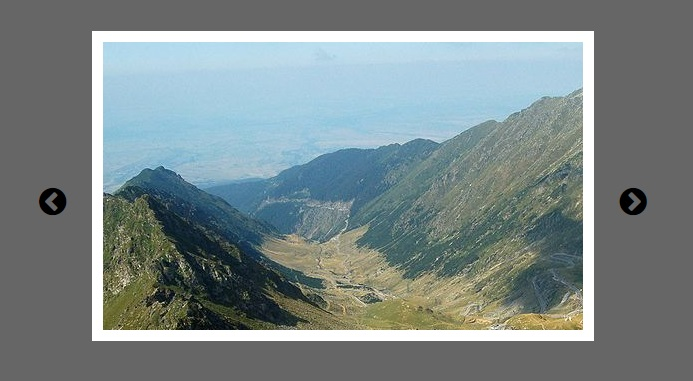

# simple-slider
Простой слайдер на чистом JavaScript
### Преимущества
---
- не нужны фреймворки и дополнительные библиотеки
- совместим с IE
- возможность настройки стилей
- возможность установки нескольких слайдеров на страницу
- простое подключение
---
### [пример использования ➫](https://avavax.ru/src/1003/)
### Порядок установки
---
1. В код html вставить div.slider со всем содержимым
2. Подключить sсript.js и style.css
3. Добавить слайды в папку img и прописать пути в блоке div.slider-data
4. Стилизовать css по желанию

